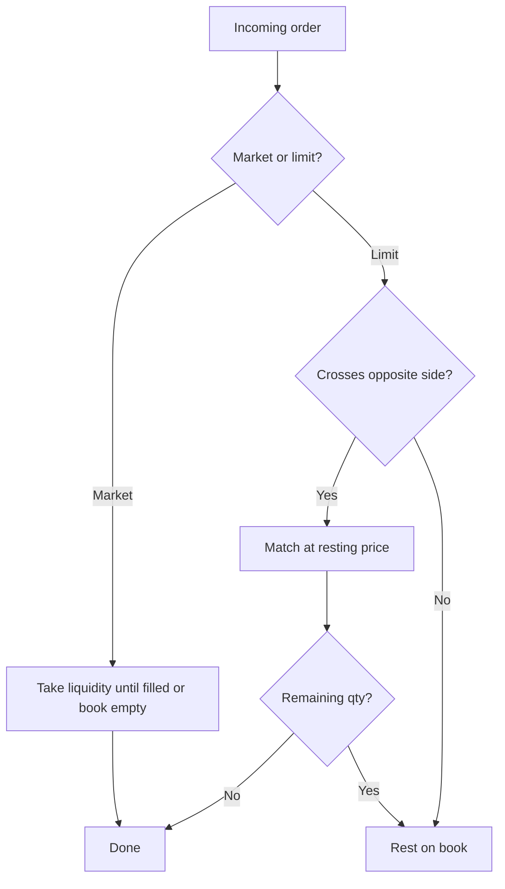
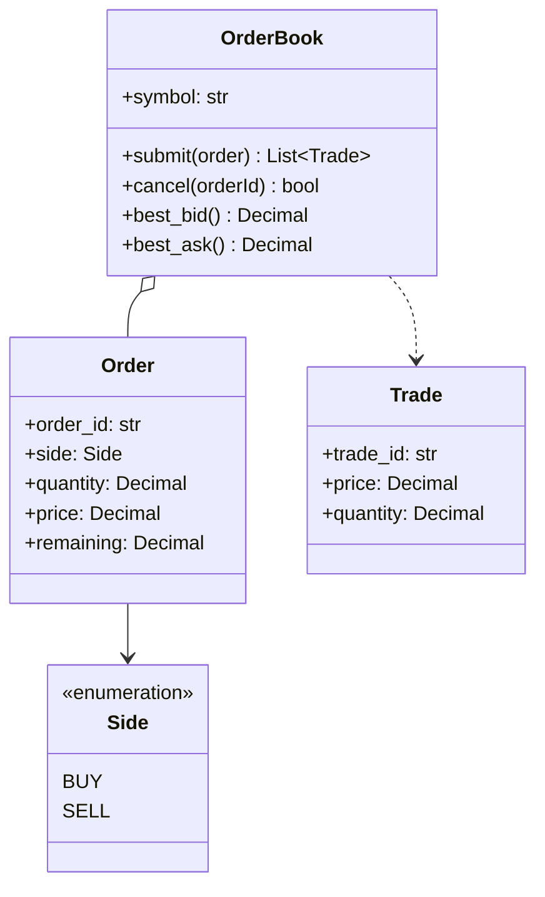

# Order Matching Engine

Price-time priority limit order book for a single instrument. Useful for studying exchange matching, market microstructure and trading-system design (crypto or traditional).

## Features

- Limit and market orders
- Price-time priority at each price level
- Partial fills, resting liquidity and cancel
- Deterministic trade prints

## How matching works



## Quick start

```bash
python -m pip install -e ".[dev]"
pytest -q
```

```python
from decimal import Decimal
from order_matching_engine import Order, OrderBook, OrderType, Side

book = OrderBook("BTC-USDT")
book.submit(Order("s1", Side.SELL, Decimal("1"), Decimal("100")))
trades = book.submit(Order("b1", Side.BUY, Decimal("1"), Decimal("100")))
print(trades[0].price, trades[0].quantity)
```

## Domain model



## License

MIT
